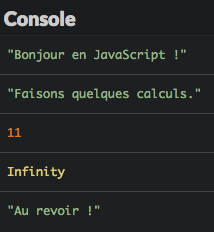

PROGRAMME
=========

C'est le moment de faire vos premiers pas avec JavaScript !

Un premier programme
--------------------

Voici votre tout premier programme.

``` javascript
console.log("Bonjour en JavaScript !");
```

Ce programme affiche dans la console le texte
`"Bonjour en JavaScript !"`. Pour cela, il utilise l'ordre JavaScript
`console.log()`, dont le rôle est d'afficher une information. Le texte à
afficher est placé entre parenthèses et suivi d'un point-virgule.

Afficher un texte à l'écran (le fameux [Hello
World](https://fr.wikipedia.org/wiki/Hello_world) bien connu des
programmeurs) est souvent la première chose que l'on apprend à faire
lorsqu'on découvre un nouveau langage. Vous venez de franchir cette
première étape !

Structure d'un programme
------------------------

Nous avons précédemment défini un programme informatique comme étant une
liste d'ordres indiquant à un ordinateur ce qu'il doit faire. Ces ordres
sont écrits sous forme de texte dans un ou plusieurs fichiers et forment
ce qu'on appelle le code source du programme. Les lignes de texte dans
un fichier de code source s'appellent des **lignes de code**.

I&gt; Le code source peut comporter des lignes vides : celles-ci seront
ignorées lors de l'exécution du programme.

### Instructions

Chaque ordre inclus dans un programme est appelée une **instruction**.
Une instruction est délimitée par un point virgule. Un programme est
constitué d'une suite d'instructions.

I&gt; Le plus souvent, on n'écrit qu'une seule instruction par ligne,
mais ce n'est pas une obligation.

### Déroulement de l'exécution

Lorsqu'un programme est exécuté, les instructions qui le composent sont
"lues" les unes après les autres. Chaque instruction produit un
résultat, et c'est la combinaison de ces résultats individuels qui
produit le résultat final du programme.

Voici un exemple de programme JavaScript composé de plusieurs
instructions.

``` js
console.log("Bonjour en JavaScript !");
console.log("Faisons quelques calculs.");
console.log(4 + 7);
console.log(12 / 0);
console.log("Au revoir !");
```

Le résultat de son exécution est le suivant.



I&gt; On remarque au passage qu'une division par zéro (ici `12/0`)
produit, comme attendu, un résultat infini (`Infinity`).

### Commentaires

Par défaut, chaque ligne de texte dans les fichiers source d'un
programme est considérée comme une instruction à exécuter. Il est
possible d'exclure certaines lignes de l'exécution en les préfixant par
une double barre oblique `//`. Ce faisant, on transforme ces lignes en
**commentaires**.

``` js
console.log("Bonjour en JavaScript !");
//console.log("Faisons quelques calculs.");
console.log(4 + 7);
//console.log(12 / 0);
console.log("Au revoir !");
```

Lors de l'exécution, les lignes commentées ne produisent plus de
résultat.


Les commentaires servent à donner des informations sur le programme et
sont destinées au programmeur, non à la machine.

I&gt; Il existe une autre manière de créer des commentaires en entourant
une ou plusieurs lignes par les caractères `/*` et `*/`. I&gt; I&gt; /\*
Un commentaire I&gt; sur plusieurs I&gt; lignes \*/ I&gt; I&gt; // Un
commentaire sur une seule ligne

Les commentaires fournissent une aide précieuse pour comprendre le code
source d'un programme. Il est important de décrire les parties
importantes ou compliquées d'un programme grâce à des commentaires.
Prenez cette bonne habitude dès maintenant !
